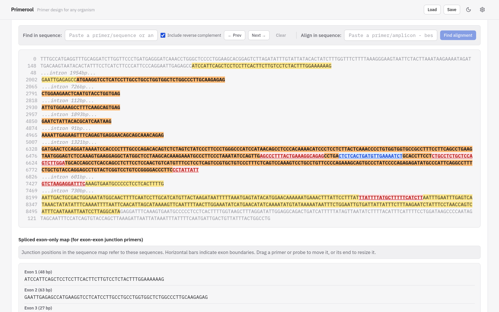
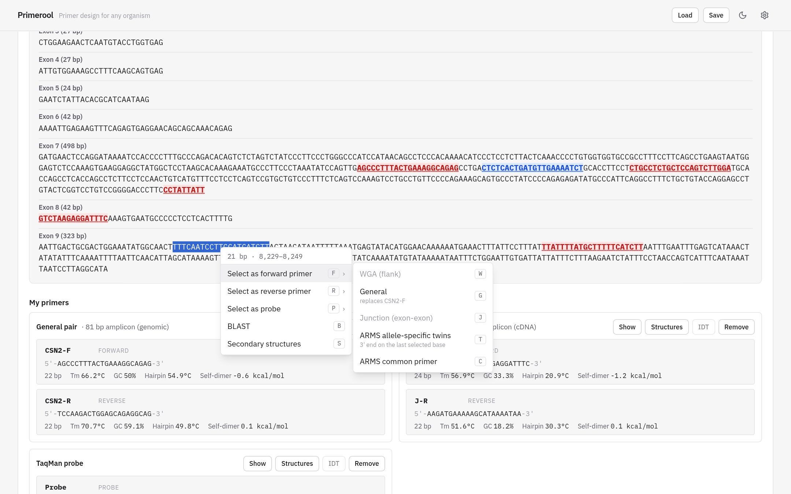
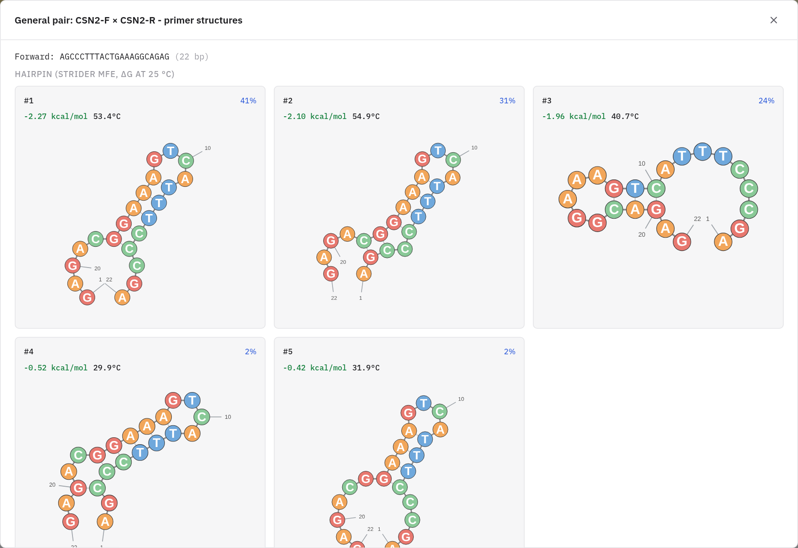
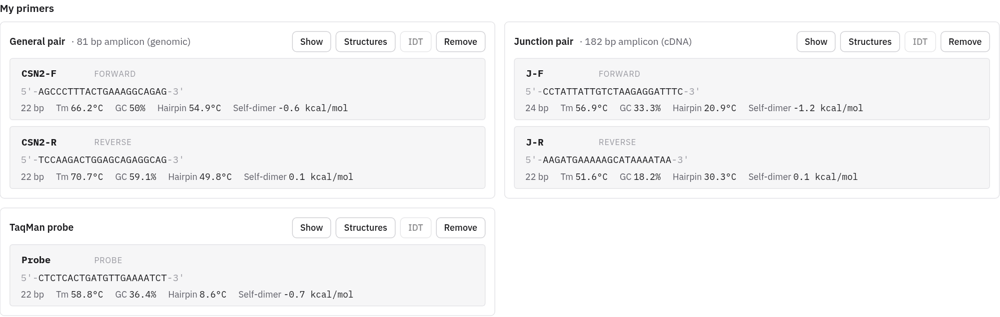
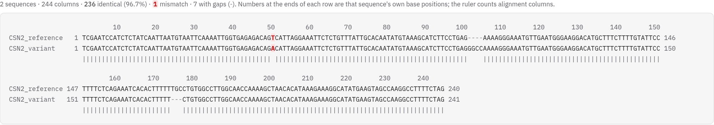
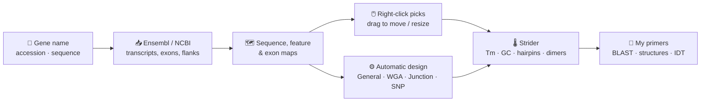
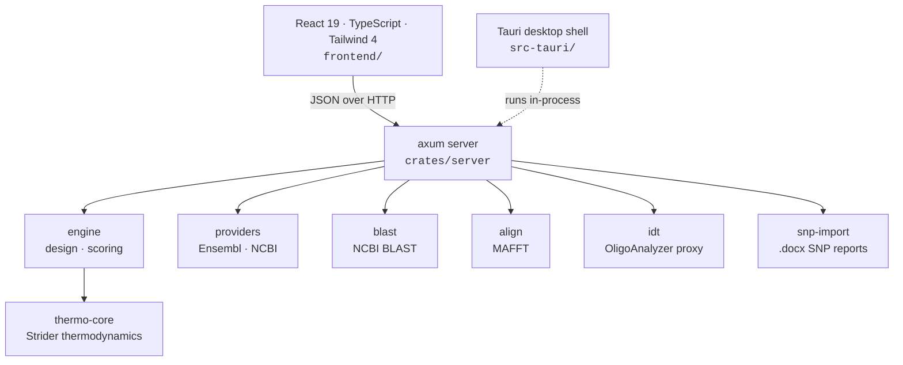

<div align="center">


# Primerool

**Primer & probe design for any organism: from a gene name to checked oligos in minutes.**

[](https://primerool.ubch.sci.muni.cz/)

[](crates/server)
[](frontend)
[](frontend)
[](frontend)
[](frontend)
[](src-tauri)
[](LICENSE)

[**Features**](#features) · [**Quick start**](#quick-start) · [**How it works**](#how-it-works) · [**Architecture**](#architecture) · [**Development**](#development)

<br />

<picture>
  <source media="(prefers-color-scheme: dark)" srcset="docs/images/sequence-map-dark.png" />
  
</picture>

</div>

<br />

Primerool fetches genes live from **Ensembl** or **NCBI**, lays them out as an interactive sequence map, and lets you place primers and probes by hand or have them designed for you. Every oligo is checked right away for Tm, GC content, hairpins and dimers by its own native thermodynamics engine, **Strider**. You don't need genome files, a database or an install: open it in a browser.

<table>
  <tr>
    <td width="33%" valign="top">
      <h3>Any organism</h3>
      51 preset species across animals, plants, bacteria, fungi, protists and viruses, plus any Ensembl species name. You can also paste an accession or a raw sequence.
    </td>
    <td width="33%" valign="top">
      <h3>Direct design</h3>
      Select bases, right-click and choose what to make. Drag a primer to move it, or drag its end to resize it. Everything is recomputed as you go.
    </td>
    <td width="33%" valign="top">
      <h3>One native engine</h3>
      Strider (native Rust nearest-neighbour + Mathews 2004 folding) picks and checks every oligo, with an IDT OligoAnalyzer Tm next to Strider's when you want a second opinion.
    </td>
  </tr>
  <tr>
    <td valign="top">
      <h3>Every assay type</h3>
      General PCR, whole-gene (WGA), exon–exon junction (qRT-PCR), ARMS allele-specific, TaqMan and allele-detection probes.
    </td>
    <td valign="top">
      <h3>Alignments</h3>
      MAFFT multiple alignment shown the classic way (numbered rows and a match line), plus primers designed in conserved regions.
    </td>
    <td valign="top">
      <h3>Keeps your work</h3>
      Primer sets remembered per sequence, sessions saved to a file or autosaved, and light/dark themes with your own accent colour.
    </td>
  </tr>
</table>

---

## Features

### Find your gene

- **Search by gene name** (e.g. *BRCA1*, *CSN2*) or **accession** (e.g. `NM_001443849.1`). An accession is identified through NCBI BLAST and resolved to its gene.
- **Ensembl REST or NCBI E-utilities**: switch sources whenever one of them is slow.
- **Every annotated transcript** is listed, with the canonical one pre-selected. You choose genomic DNA (with introns) or spliced mRNA, with or without UTRs, and with upstream/downstream flanks of any length.
- **Custom sequences**: paste any sequence and design on it directly.
- **SNP batch import**: upload a per-variant flanking-sequence report (`.docx`, `[REF/ALT]`-marked) and design flanking primers for every SNP in one go.

### Read the sequence

- **Sequence map**:
  - CDS, UTRs, flanks and introns in their own colours; introns can be collapsed to their length.
  - Hover any base for its position in the gene and its genomic coordinate.
  - **Find in sequence**: a literal search (optionally the reverse complement too) or an **rsID lookup** that pins the SNP on the map.
  - **Align in sequence**: Smith–Waterman finds where a pasted primer or amplicon binds best, mismatches included.
- **Feature map**: a zoomable overview of exons, introns, CDS and UTRs, with your primers overlaid.
- **Exon map**: the spliced transcript exon by exon, for placing junction primers where they cross the splice site.

<picture>
  <source media="(prefers-color-scheme: dark)" srcset="docs/images/exon-map-dark.png" />
  
</picture>

### Design primers and probes

**By hand.** Select bases on any map and right-click:

| Pick | What it makes |
|---|---|
| **General** | A forward or reverse primer anywhere in the gene |
| **WGA (flank)** | Primers in the flanks, to amplify the whole locus |
| **Junction** | A primer spanning an exon–exon junction; its partner may sit anywhere in the gene |
| **ARMS twins / common** | Allele-specific wild-type/mutant twins with their 3′ end on the SNP, plus the common primer |
| **Probe: general** | A TaqMan hydrolysis probe |
| **Probe: allele detection** | A wild-type/mutant probe pair differing only at the SNP |
| **BLAST · Secondary structures** | For any selection, or any placed primer |

Placed primers and probes can be **dragged to move** or **resized by their ends** on both the sequence map and the exon map. ARMS twins keep their 3′ end locked on the SNP, allele probes can't lose their SNP, and each mutant partner follows its wild-type twin.

**Automatically.** Four design modes rank candidate pairs by penalty, each with Tm, GC%, hairpin, self-dimer and heterodimer checks:

| Mode | For |
|---|---|
| **General** | Primers anywhere in the gene, to a target amplicon length |
| **WGA** | Whole-gene amplification from the flanking regions |
| **Junction** | cDNA-specific qRT-PCR primers across exon–exon junctions |
| **SNP/indel** | ARMS-PCR allele-specific primer sets |

### Check every oligo

<table>
  <tr>
    <td width="55%" valign="top">
      <picture>
        <source media="(prefers-color-scheme: dark)" srcset="docs/images/structures-dark.png" />
        
      </picture>
    </td>
    <td valign="top">

- **Strider**, a plain-Rust DNA thermodynamics core: nearest-neighbour Tm with salt and Mg²⁺/dNTP corrections, hairpin and dimer ΔG, and **ranked suboptimal secondary structures** drawn as diagrams.
- **Strider's own picker** scans every candidate window, filters on Tm, GC, poly-X runs, hairpins and dimers, and ranks what's left; no Primer3 needed.
- **IDT OligoAnalyzer**: one click adds IDT's own Tm next to Strider's, under the same conditions. Your IDT credentials are stored **encrypted in your browser** (AES-GCM, non-extractable key).
- **NCBI BLAST** with identity and query cover for any oligo or region.

    </td>
  </tr>
</table>

One set of reaction conditions is used everywhere: design, analysis, structures and IDT. It matches IDT OligoAnalyzer's qPCR preset:

| Na⁺ | Mg²⁺ | dNTPs | Oligo |
|:---:|:---:|:---:|:---:|
| 50 mM | 3 mM | 0.8 mM | 0.2 µM |

### Keep track

<picture>
  <source media="(prefers-color-scheme: dark)" srcset="docs/images/primer-sets-dark.png" />
  
</picture>

- **My primers** gathers every set on the loaded sequence: WGA, general and junction pairs, the ARMS set and the probes. Each shows its amplicon size and Strider numbers, and has **Show**, **Structures**, **IDT** and **Remove**. Names are editable.
- Primer sets are **remembered per sequence**. Load the same gene and transcript again and they're back.
- **Sessions**: save everything to a `.primerool.json` file, load it later, or pick up an autosave.

### Align and design across sequences

<picture>
  <source media="(prefers-color-scheme: dark)" srcset="docs/images/alignment-dark.png" />
  
</picture>

- Paste **FASTA**, **GenBank** (a whole record or just its numbered sequence lines) or one bare sequence per line. You can also add the loaded sequence, or **every other transcript variant** of the gene, in one click.
- **MAFFT** aligns them. The result shows the classic way: a column ruler, one numbered row per sequence, a match line, mismatches highlighted and gaps dimmed.
- **Design primers in a conserved column range**, as individual candidates or as pairs around a target.

---

## Quick start

### Use it online

**→ [primerool.ubch.sci.muni.cz](https://primerool.ubch.sci.muni.cz/)**. Nothing to install.

### Run it locally

<details open>
<summary><b>Prerequisites</b></summary>

| Tool | Why |
|---|---|
| [Rust](https://rustup.rs/) (stable) | the server and the thermodynamics engines |
| A C compiler *(tests only)* | builds the vendored Primer3 used as a reference in `cargo test --workspace` |
| [Node.js](https://nodejs.org/) 20.19+ | the frontend (Vite 7) |
| [MAFFT](https://mafft.cbrc.jp/alignment/software/) *(optional)* | multi-sequence alignment |

</details>

```bash
git clone --recurse-submodules https://github.com/KowalskiBio/Primerool.git
cd Primerool

npm run setup   # cargo build (minus the Primer3 reference crates) + frontend npm install
npm run dev     # Rust API on :5050 + Vite on :5173, with hot reload
```

Then open **http://localhost:5173**.

### Desktop app

The [Tauri](https://tauri.app/) shell in [`src-tauri/`](src-tauri) runs the same server in-process and opens it in a native window:

```bash
cargo install tauri-cli
cargo tauri build     # builds the frontend first, then the native app
```

---

## How it works



---

## Architecture

The backend is a Rust workspace with one job per crate, and the frontend is a React single-page app. In production, one `axum` binary serves both the API and the built frontend.



| Crate | Role |
|---|---|
| [`server`](crates/server) | axum HTTP/JSON API: routing, validation and response shaping only |
| [`engine`](crates/engine) | Design modes plus the Strider picker: candidate scan / filter / score / rank |
| [`thermo-core`](crates/thermo-core) | **Strider**: plain-Rust Tm, salt corrections, hairpin/dimer ΔG, Mathews 2004 folding |
| [`primer3-ffi`](crates/primer3-ffi) · [`primer3-sys`](crates/primer3-sys) | Test-only: bindings to the vendored Primer3, used to compare Strider against it ([ADR 0001](docs/adr/0001-strider-only-engine.md)) |
| [`providers`](crates/providers) | `SequenceProvider` trait with Ensembl and NCBI implementations |
| [`blast`](crates/blast) | NCBI BLAST: submit, poll, fetch, parse |
| [`align`](crates/align) | MAFFT subprocess wrapper |
| [`idt`](crates/idt) | IDT OligoAnalyzer OAuth2 proxy; credentials are per-request and never stored |
| [`snp-import`](crates/snp-import) | Parses per-SNP flanking-sequence `.docx` reports |

<details>
<summary><b>Repository layout</b></summary>

```
Primerool/
├── crates/            Rust workspace: server, engine, thermo-core, providers, …
├── frontend/          React + TypeScript + Tailwind single-page app (Vite)
├── src-tauri/         Tauri desktop shell
├── vendor/primer3-py/ Primer3 C sources (git submodule, test reference only)
├── scripts/           setup, dev runner, VM deploy, golden fixtures
├── docs/adr/          architecture decision records
└── docs/images/       README screenshots
```

</details>

---

## Development

```bash
cargo test --workspace                     # Rust unit + parity tests
cargo test -p server --test golden -- --ignored   # replay live API fixtures (network)
npm --prefix frontend run lint             # ESLint
npm --prefix frontend run build            # type-check + production build
```

The golden fixtures in [`scripts/golden/fixtures`](scripts/golden/fixtures) pin the API's responses, so behaviour stays stable across refactors.

**Deploying to a server:** [`scripts/deploy_vm.sh`](scripts/deploy_vm.sh) fast-forwards the checked-out branch, builds the release server and the frontend, backs up the live install, restarts the systemd service, health-checks it, and rolls back automatically if the check fails.

---

## Acknowledgements

Primerool stands on the shoulders of [MAFFT](https://mafft.cbrc.jp/alignment/software/), the [Ensembl REST API](https://rest.ensembl.org/), [NCBI E-utilities and BLAST](https://www.ncbi.nlm.nih.gov/), and [IDT OligoAnalyzer](https://www.idtdna.com/pages/tools/oligoanalyzer). Nearest-neighbour parameters follow SantaLucia & Hicks (2004); folding energies follow Mathews *et al.* (2004). [Primer3](https://github.com/primer3-org/primer3) (via [primer3-py](https://github.com/libnano/primer3-py)) set the defaults Strider's picker follows and serves as the reference in its tests.

## License

Released into the public domain under [CC0 1.0 Universal](LICENSE): use it freely, for any purpose.

<div align="center">
<br />
<sub>Made for the bench by <b>Vojtěch Rejtar</b> · <a href="https://primerool.ubch.sci.muni.cz/">primerool.ubch.sci.muni.cz</a></sub>
</div>
